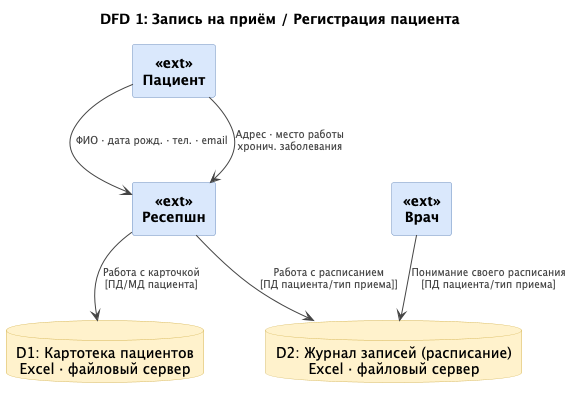
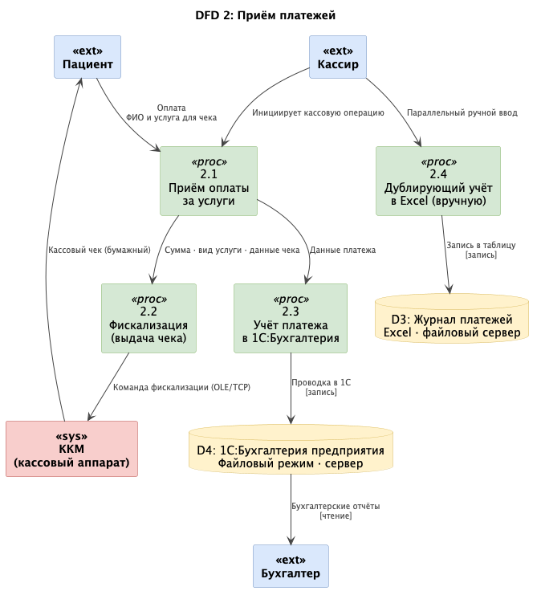
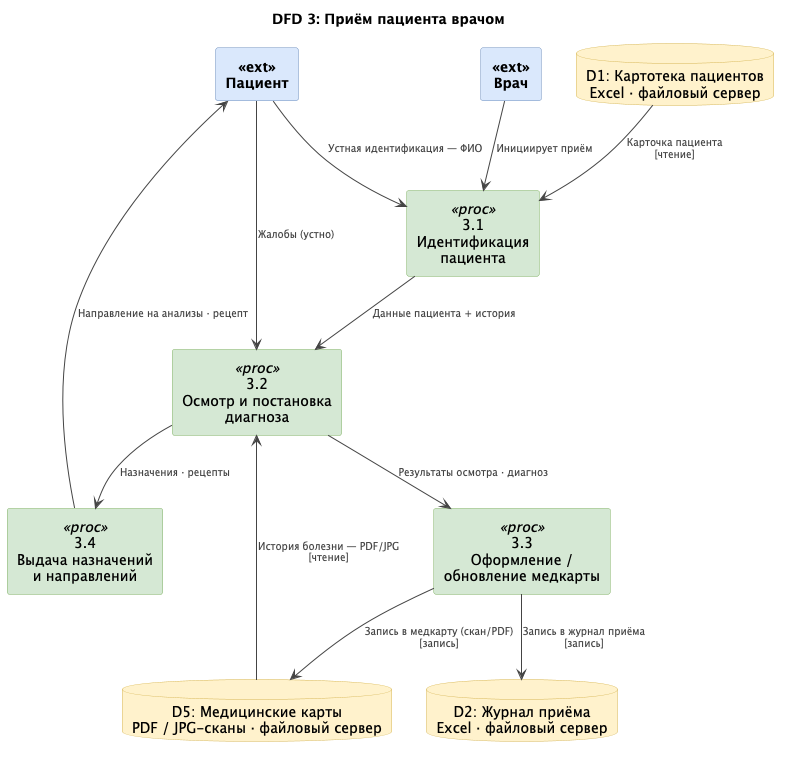
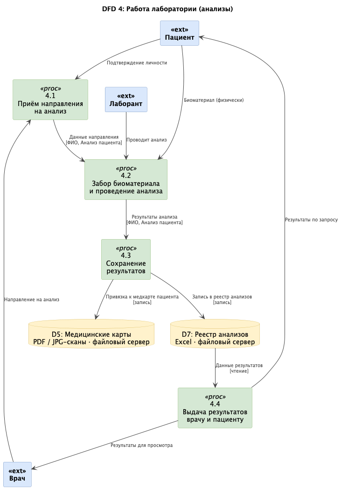

# Процессы и учет конф. данных AS-IS

Исходя из задания, план компании заключается в:
- усилить безопасность медицинских карт
- уйти от ручной записи клиентов и перейти на единую систему хранения и управления данными
- - объединит журналы приёма пациентов
- - учёт пациентов
- - учёт оплаты услуг

Можно выделить 4 процесса:

## Запись на прием/регистрация пациента

## Прием платежей

Пациент, Кассир, Бухгалтер

## Прием пациента врачом

Пациент, Врач

## Работа лаборатории (анализы)

Пациент, Лаборант, Врач

