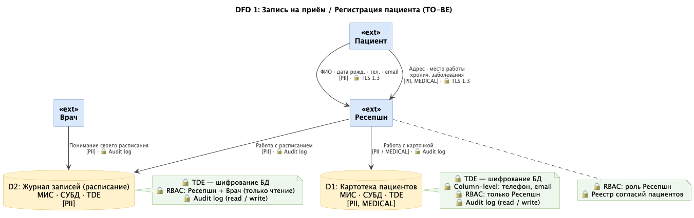
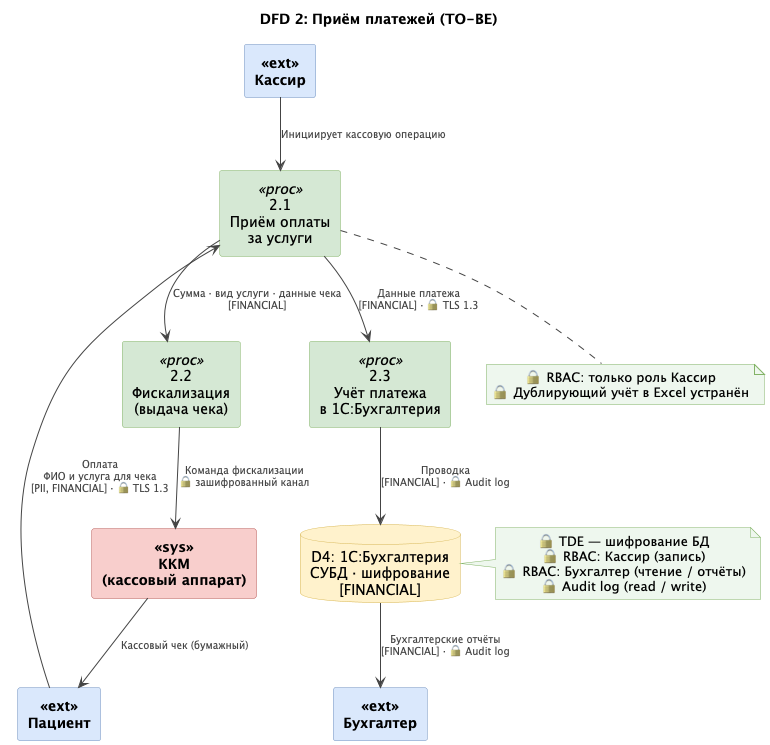
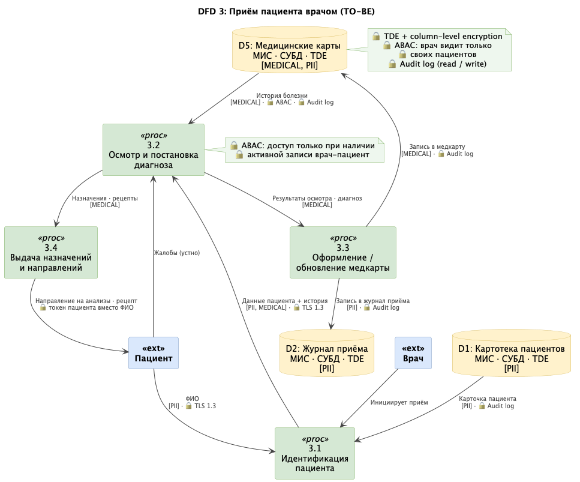
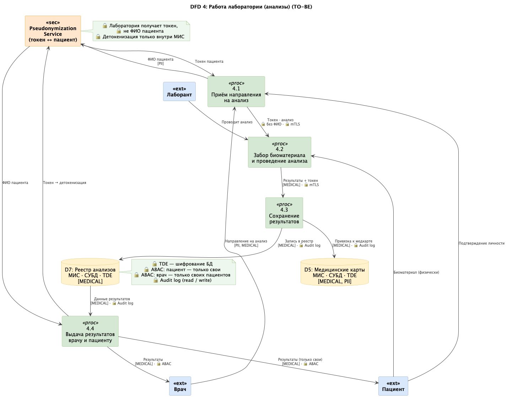

# Меры по защите данных — Медикаменте

---

## Механизм тегирования

Тег — это метаданные о данных, которые хранятся отдельно в **Data Catalog**.

При каждом запросе к данным Policy Engine (OPA) обращается к Data Catalog, узнаёт какой тег у запрашиваемого поля, и на основе этого решает — пропустить запрос или заблокировать. Это значит что политики доступа можно менять без изменения самой базы данных.

Сейчас данные разрознены по Excel, сканам и 1С — тегирование в таком стеке невозможно применять системно. Полноценный механизм тегирования реализуется при переходе на единую МИС (медицинскую информационную систему), где данные структурированы и хранятся централизованно.

### Используемые теги

| Тег         | Что включает                                                                                                                                               |
|-------------|------------------------------------------------------------------------------------------------------------------------------------------------------------|
| `PII`       | ФИО, дата рождения, телефон, email, адрес, место работы                                                                                                    |
| `MEDICAL`   | Все медицинские данные: диагнозы, назначения, результаты анализов, история посещений, хронические заболевания — специальная категория ПДн по ст. 10 152-ФЗ |
| `FINANCIAL` | Суммы, платежи, фискальные данные                                                                                                                          |

### Что тег даёт на практике

- **Управление доступом** — политики RBAC/ABAC проверяют тег и решают, можно ли пользователю с его ролью получить эти данные
- **Шифрование** — данные с тегами `MEDICAL` и `PII` автоматически шифруются at rest
- **Маскирование** — при отображении в интерфейсе данные с тегом `PII` частично скрываются для ролей без полного доступа
- **Audit log** — любое обращение к данным с тегом `MEDICAL` обязательно логируется
- **Обезличивание** — при выгрузке для аналитики данные с тегами `PII` и `MEDICAL` обезличиваются или заменяются токеном

---

## Запись на приём / Регистрация пациента

### Данные и защита

| Данные                  | Тег       | Способ защиты                                   |
|-------------------------|-----------|-------------------------------------------------|
| ФИО                     | `PII`     | Шифрование at rest, обфускация при отображении  |
| Дата рождения           | `PII`     | Шифрование at rest                              |
| Телефон, email          | `PII`     | Шифрование at rest, обфускация при отображении  |
| Адрес                   | `PII`     | Шифрование at rest                              |
| Хронические заболевания | `MEDICAL` | Шифрование at rest, обезличивание для аналитики |

### Инструменты и меры

- **TLS 1.3** — шифрование канала при передаче данных между ресепшн и сервером
- **TDE (Transparent Data Encryption)** — шифрование данных на уровне СУБД; для отдельных полей (телефон, email) — column-level encryption
- **RBAC** — доступ к картотеке пациентов только для роли Ресепшн
- **Audit log** — фиксация всех операций чтения и записи ПДн
- **Реестр согласий** — учёт письменных согласий пациентов на обработку ПДн

---

## Приём платежей

### Данные и защита

| Данные                 | Тег         | Способ защиты                                                               |
|------------------------|-------------|-----------------------------------------------------------------------------|
| Сумма                  | `FINANCIAL` | Шифрование at rest                                                          |
| Вид услуги (для кассы) | `FINANCIAL` | Шифрование at rest, Использование официальной номенклатуры Минздрава РФ     |
| ФИО на чеке            | `PII`       | Шифрование at rest, обфускация в отчётах, но в чеках обязано присутствовать |

### Инструменты и меры

- **СУБД с шифрованием** — перевод 1С с файлового режима на клиент-серверный, данные хранятся в зашифрованной базе
- **RBAC** — разделение ролей: Кассир видит только кассовые операции, Бухгалтер — только свой участок
- **Audit log** — фиксация всех финансовых операций с указанием пользователя и времени

---

## Приём пациента врачом

### Данные и защита

| Данные                  | Тег       | Способ защиты                                   |
|-------------------------|-----------|:------------------------------------------------|
| Диагноз, назначения     | `MEDICAL` | Шифрование at rest, обезличивание для аналитики |
| Хронические заболевания | `MEDICAL` | Шифрование at rest, обезличивание для аналитики |
| История посещений       | `MEDICAL` | Шифрование at rest                              |
| ФИО                     | `PII`     | Шифрование at rest                              |

### Инструменты и меры

- **TDE / column-level encryption** — шифрование медицинских данных в СУБД
- **ABAC** — врач получает доступ только к картам пациентов с активной записью к нему; ФИО и данные видны полностью, но только для своих пациентов
- **Audit log** — каждое обращение к медкарте логируется: кто, когда, какой пациент

---

## Работа лаборатории (анализы)

### Данные и защита

| Данные                 | Тег       | Способ защиты                                   |
|------------------------|-----------|-------------------------------------------------|
| Результаты анализов    | `MEDICAL` | Шифрование at rest, обезличивание для аналитики |
| Направление на анализ  | `MEDICAL` | Шифрование канала передачи                      |
| Идентификатор пациента | `PII`     | Псевдонимизация — передаётся токен вместо ФИО   |

### Инструменты и меры

- **Псевдонимизация** — лаборатория получает токен пациента вместо ФИО; результаты возвращаются по тому же токену и детокенизируются на стороне МИС перед выдачей врачу или пациенту
- **TLS 1.3** — шифрование канала при передаче направлений и получении результатов
- **RBAC / ABAC** — доступ к реестру анализов ограничен: пациент видит только свои результаты, врач — только своих пациентов
- **Audit log** — фиксация всех операций с реестром анализов
